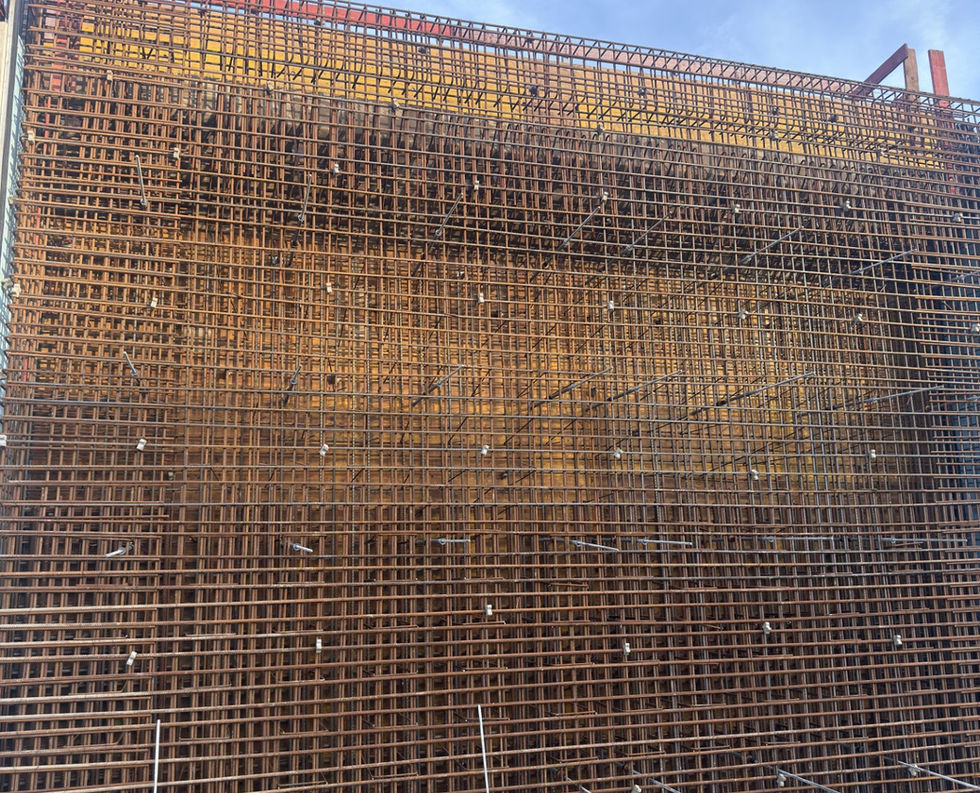

# NordKernBau Website

Profesyonel bir website kuzeninin inşaat demiri işletmesi (Bewehrungsarbeiten) için.

## 📂 Dosya Yapısı

```
nordkernbau/
├── index.html          # Ana sayfa
├── impressum.html      # Hukuki/İmprint sayfası
├── datenschutz.html    # Gizlilik politikası
├── style.css           # Tasarım ve stiller
├── script.js           # JavaScript interaktivite
└── README.md           # Bu dosya
```

## 🎨 Tasarım Özellikleri

- **Modern ve Profesyonel**: Soybas.com/tr tarzında sade tasarım
- **Responsive**: Mobil, tablet ve masaüstünde mükemmel görünüm
- **Renk Şeması**: Açık siyah (#2a2a2a) aksan rengi, profesyonel gri tonları
- **Typography**: Sistem fontları (Apple, Segoe UI, Roboto)

## 📄 Sayfalar

### 1. Ana Sayfa (index.html)
- Hero bölümü dengan slogan
- Hakkımızda
- Hizmetler
- Neden Biz (5 ana özellik)
- Galeri (Placeholder görseller)
- İletişim Formu
- Footer

### 2. İmprint (impressum.html)
- Şirket bilgileri
- Sorumlu kişi
- İletişim detayları
- Yasal bilgiler

### 3. Gizlilik Politikası (datenschutz.html)
- Veri koruma bilgileri
- DSGVO uyumluluğu
- Kullanıcı hakları

## 🚀 Kurulum ve Kullanım

### Dosyaları Hosting'e Yükleme

1. Tüm dosyaları (`index.html`, `style.css`, `script.js`, `impressum.html`, `datenschutz.html`) aynı klasöre yükleyin
2. Domain/hosting sağlayıcınızda bu klasörü public_html veya www klasörüne yerleştirin
3. Website'yi browser'da açın

### Lokal Test (Bilgisayarınızda)

1. Dosyaları bilgisayarınıza indirin
2. `index.html` dosyasını browser'da açın (Firefox, Chrome, Safari, Edge)

## ✏️ Özelleştirme

### Renkleri Değiştirmek
`style.css` dosyasında aşağıdaki CSS değişkenlerini değiştirin:

```css
:root {
    --primary-color: #2a2a2a;      /* Ana renk */
    --accent-color: #3d3d3d;       /* Vurgu rengi */
    --light-bg: #f5f5f5;           /* Açık arka plan */
}
```

### İletişim Formunu Ayarlamak

Formun e-mail gönderimini etkinleştirmek için:

1. [Formspree.io](https://formspree.io) adresine gidin
2. Ücretsiz bir hesap oluşturun
3. `script.js` dosyasında bu satırı bulun:
```javascript
const formspreeURL = 'https://formspree.io/f/xjkvwnea';
```
4. `xjkvwnea` yerine kendi Formspree ID'nizi yazın

**Alternativ:** E-mail hizmeti olmadan form sadece uyarı gösterebilir.

### Görselleri Değiştirmek

Placeholder görselleri kendi resimlerinizle değiştirmek için:

1. Görselleri `images/` klasörüne yerleştirin
2. `index.html` dosyasında bu satırları bulun:
```html

```
3. Kendi resimlerinizin yoluna değiştirin:
```html

```

### İçeriği Güncellemek

Tüm içerikler `index.html`, `impressum.html` ve `datenschutz.html` dosyalarında bulunur.
Herhangi bir metin editörü (VS Code, Notepad++ vb.) ile dosyaları düzenleyebilirsiniz.

## 📱 Responsive Özellikler

- **Desktop (1200px+)**: Tam genişlik, normal görünüm
- **Tablet (768px - 1199px)**: Ayarlanmış grid ve spacing
- **Mobile (480px - 767px)**: Mobil menü, stacked layout
- **Small Phone (<480px)**: Minimal fontlar, tam mobil optimizasyon

## 🔍 SEO ve Meta Tags

Meta tags `index.html` dosyasında ayarlanmıştır:
- Description
- Viewport (responsive)
- Language (German)

## 📧 İletişim Bilgileri

Sitede kullanılan bilgiler:
- **Telefon**: +49 157 78516587
- **Email**: info@nordkernbau.de
- **Adres**: Schillerstr. 52, 59065 Hamm, Deutschland
- **Yönetici**: Utku T. Sahin

## 🛠️ Teknik Bilgiler

- **HTML5**: Semantik yapı
- **CSS3**: Flexbox ve Grid layout
- **JavaScript**: Vanilla JS (framework yok)
- **Formlar**: Formspree entegrasyonu
- **Performance**: Optimize edilmiş, hızlı yükleme

## 📋 Kontrol Listesi

- [x] Responsive tasarım
- [x] İletişim formu (email entegrasyonu için hazır)
- [x] Hukuki sayfalar (Impressum, Datenschutz)
- [x] Mobile menü
- [x] Smooth scroll
- [x] Hover efektleri
- [x] Accessibility basics

## 💡 İpuçları

1. **Backup Alın**: Değişiklik yapmadan önce dosyaları yedekleyin
2. **Test Edin**: Tüm bağlantıları ve formu test edin
3. **SEO**: Google Search Console'a site ekleyin
4. **Analytics**: Google Analytics kod eklemek için `</head>` etiketinden önce kodu ekleyin

## 📞 Destek

Herhangi bir sorun için iletişim bilgilerine bakın.

---

**Oluşturulma Tarihi**: Mart 2024
**Versiyon**: 1.0
